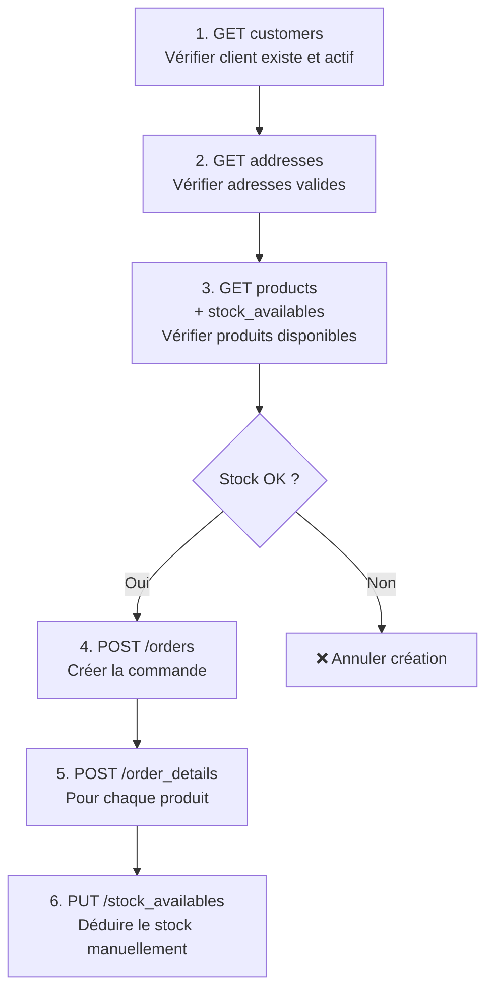

# Vérifications manuelles lors de la création d'une commande via `POST /orders` dans PrestaShop

Je comprends parfaitement votre situation : vous n'avez pas le choix et devez passer par l'API directe. Dans ce cas, il est essentiel de comprendre quelles vérifications PrestaShop ne fait pas automatiquement, pour que vous puissiez les implémenter vous-même et garantir la cohérence des données.

Voici la liste complète des éléments que vous devez vérifier et gérer manuellement lors de la création d'une commande via `POST /orders`.

---

#  Checklist des vérifications à faire vous-même

## 1. Vérifications sur le client et les adresses

| À vérifier | Pourquoi c'est critique |
|---|---|
| Le client existe et est actif | Une commande sans client valide cassera les relations et les statistiques |
| L'adresse de livraison est valide | Utilisée pour le calcul des frais de port et les taxes |
| L'adresse de facturation est valide | Utilisée pour la facture légale |
| Le pays et la zone sont actifs | Si le pays est désactivé, la commande ne devrait pas être créée |

### Vérification recommandée

Interrogez `customers` avec :

```xml
GET /api/customers?filter[id]=X
```

Puis vérifiez le champ :

```xml
active
```

---

## 2. Vérifications sur les produits (avant insertion dans `order_details`)

| À vérifier | Comment le faire via API |
|---|---|
| Le produit existe (`id_product`) | `GET /api/products/X` |
| La déclinaison existe (`id_product_attribute`) | `GET /api/combinations?filter[id_product]=X` |
| Le stock est suffisant | `GET /api/stock_availables?filter[id_product]=X&filter[id_product_attribute]=Y` |
| Le produit est actif (`active=1`) | Vérifier dans la réponse produit |
| Le produit n'est pas obsolète (`available_for_order=1`) | Vérifier dans la réponse produit |

> ⚠️ **Point crucial sur le stock :**  
> Lorsque vous insérez des lignes dans `order_details`, PrestaShop ne déduit pas automatiquement le stock.  
> Vous devez gérer la mise à jour du stock vous-même avec `PUT /api/stock_availables`.

### Exemple de requête pour vérifier le stock d'un produit sans déclinaison

```xml
GET /api/stock_availables?filter[id_product]=5&filter[id_product_attribute]=0
```

### Mise à jour du stock après création de commande

```xml
PUT /api/stock_availables/123

<prestashop>
  <stock_available>
    <id>123</id>
    <id_product>5</id_product>
    <id_product_attribute>0</id_product_attribute>
    <quantity>NOUVELLE_QUANTITE</quantity>
  </stock_available>
</prestashop>
```

---

## 3. Vérifications sur les prix et taxes

| À vérifier | Pourquoi c'est critique |
|---|---|
| Le prix unitaire TTC est cohérent | Une commande importée doit correspondre au prix payé |
| La taxe appliquée existe | La commande doit pouvoir générer une facture légale |
| Les frais de port correspondent à un transporteur valide | Les transporteurs sont associés à des zones |

---

## 4. Données obligatoires à fournir dans `orders`

Voici les champs minimum que votre requête `POST /api/orders` doit contenir :

| Champ obligatoire | Description | Source |
|---|---|---|
| `id_customer` | ID du client | Issu de votre vérification #1 |
| `id_address_delivery` | ID de l'adresse de livraison | Issu de votre vérification #1 |
| `id_address_invoice` | ID de l'adresse de facturation | Issu de votre vérification #1 |
| `id_cart` | ID du panier associé | Si vous créez un panier au préalable |
| `id_currency` | ID de la devise | Doit correspondre à celle du client |
| `id_lang` | ID de la langue | Pour les emails et factures |
| `id_carrier` | ID du transporteur | Issu de votre vérification #3 |
| `total_paid_tax_incl` | Total TTC payé | Calculé à partir des produits + port |
| `total_paid_tax_excl` | Total HT | Calculé à partir des produits + port |
| `total_products` | Total des produits HT | Somme des prix unitaires HT |
| `total_products_wt` | Total des produits TTC | Somme des prix unitaires TTC |
| `total_shipping_tax_incl` | Frais de port TTC | Issu du transporteur |
| `total_shipping_tax_excl` | Frais de port HT | Issu du transporteur |
| `payment` | Moyen de paiement | Texte libre (`PayPal`, `Carte bancaire`, etc.) |
| `current_state` | Statut initial | `1 = En attente de paiement` typiquement |

---

## 5. Données obligatoires pour chaque ligne de `order_details`

Après avoir créé la commande, vous devez créer une entrée `order_details` pour chaque produit :

| Champ obligatoire | Description |
|---|---|
| `id_order` | L'ID de la commande créée |
| `id_product` | ID du produit |
| `id_product_attribute` | `0` si pas de déclinaison, sinon l'ID de la combinaison |
| `product_name` | Nom du produit au moment de l'achat |
| `product_quantity` | Quantité commandée |
| `product_price` | Prix unitaire HT au moment de l'achat |
| `unit_price_tax_incl` | Prix unitaire TTC |
| `total_price_tax_incl` | Prix total TTC pour cette ligne |
| `tax_name` | Nom de la taxe appliquée |
| `tax_rate` | Taux de taxe (`20.0`, etc.) |

---

# 📋 Résumé : procédure complète en 6 étapes



---

# ⚠️ Ce qui ne sera PAS fait automatiquement

| Élément | Pourquoi c'est un problème |
|---|---|
| Déduction du stock | Les stocks resteront inchangés si vous ne faites rien |
| Application des règles de promo | Les promotions du panier ne seront pas appliquées |
| Mise à jour du panier associé | Le `id_cart` restera à l'état "panier" |
| Historique des statuts | Vous devez créer un `order_history` manuellement |
| Déclenchement des hooks | Les modules liés aux nouvelles commandes ne seront pas notifiés |

---
